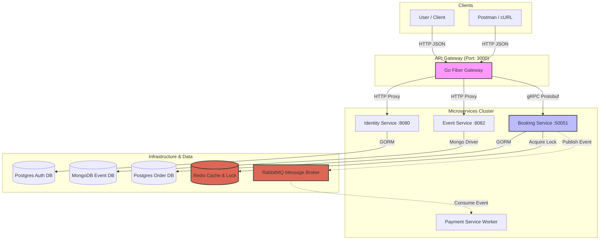
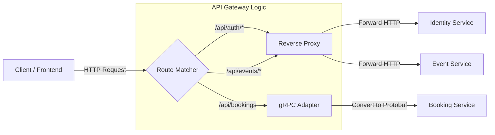
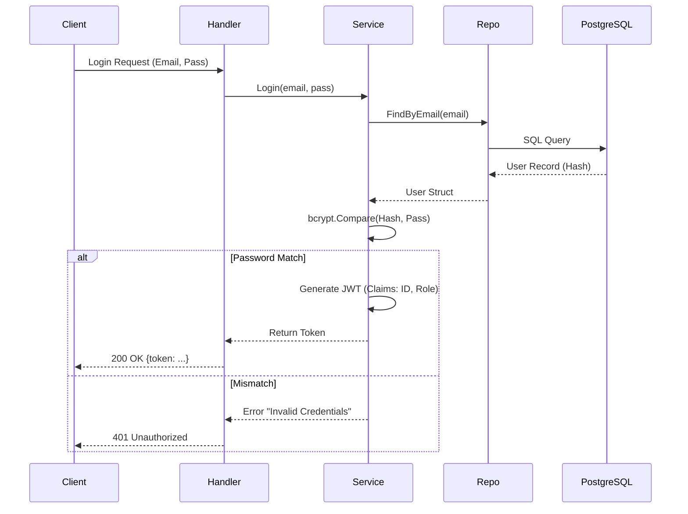
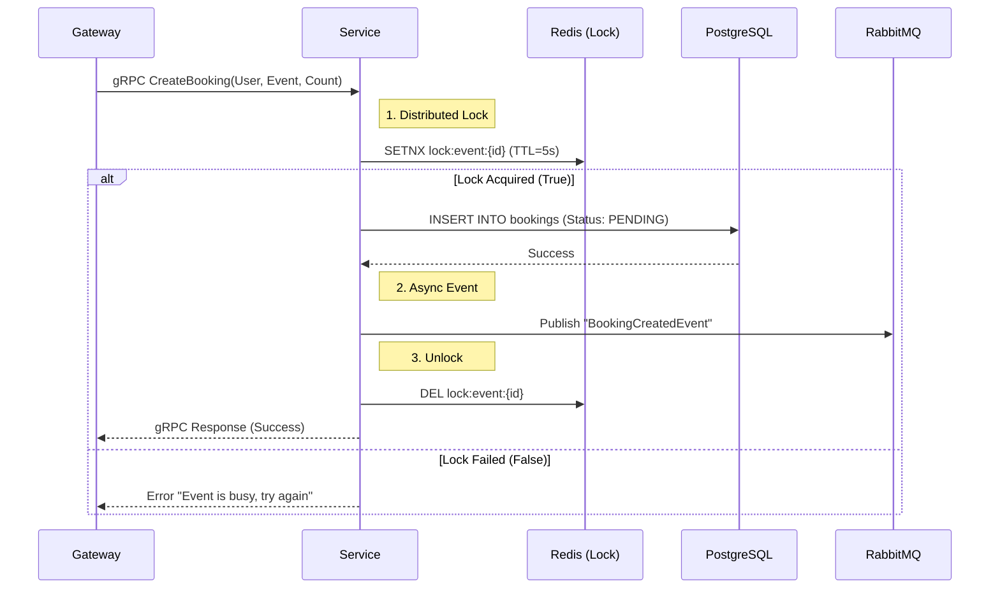
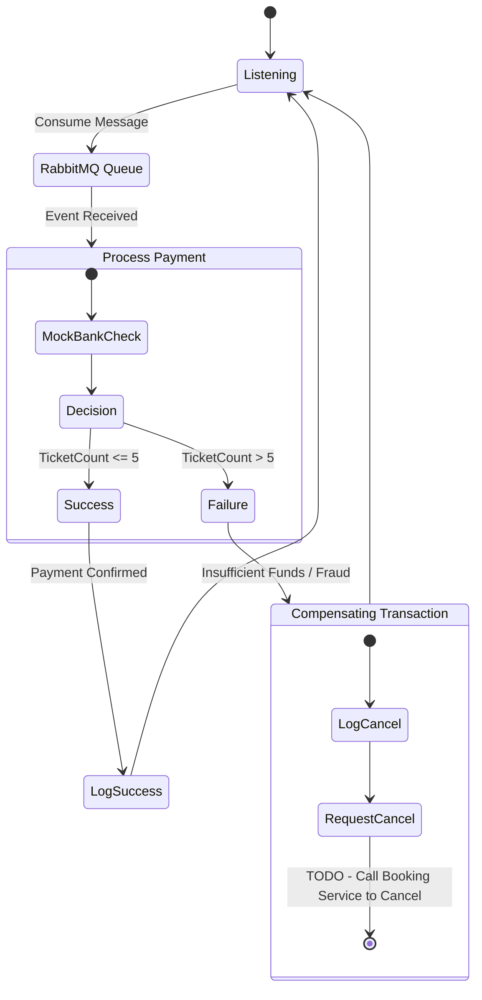
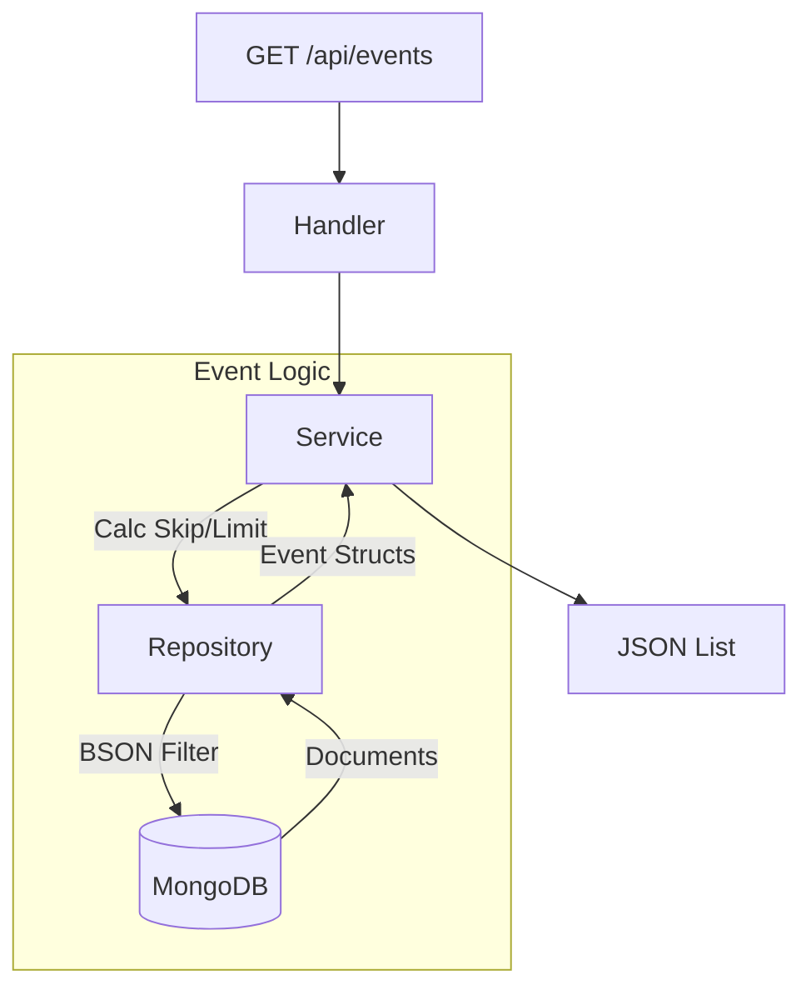

---

###  Proje Mimari Diyagramı (Mermaid)




---


#  GoTicketra - Scalable Microservices Event Ticketing Platform


**GoTicketra**, yüksek trafikli bilet satış senaryolarını simüle etmek için tasarlanmış, modern ve dağıtık bir **Biletleme Platformudur**. Bu proje, gerçek dünya senaryolarında karşılaşılan *Race Condition (Yarış Durumu)*, *Veri Tutarlılığı* ve *Asenkron İletişim* problemlerine endüstri standartlarında çözümler sunar.

---

##  Mimari & Teknoloji Yığını

Proje, **Clean Architecture** prensiplerine sadık kalınarak geliştirilmiş olup, **Monorepo** yapısında yönetilen 4 farklı mikroservis ve 1 API Gateway'den oluşmaktadır.

###  Kullanılan Teknolojiler

* **Dil:** Golang (Go 1.24)
* **Web Framework:** Fiber (v2)
* **İletişim Protokolleri:**
    * **REST (HTTP):** Frontend <-> Gateway iletişimi.
    * **gRPC (Protobuf):** Gateway <-> Booking Servisi (Yüksek performanslı dahili iletişim).
    * **AMQP (RabbitMQ):** Servisler arası asenkron olay yönetimi (Event-Driven).
* **Veritabanları & Depolama:**
    * **PostgreSQL:** Kullanıcı ve Sipariş verileri (İlişkisel Veri).
    * **MongoDB:** Etkinlik detayları (Esnek/Doküman bazlı Veri).
    * **Redis:** Distributed Locking (Stok yönetimi ve Race Condition önleme) ve Caching.
* **DevOps:** Docker, Docker Compose, Multi-Stage Builds (Alpine Linux).

---

##  Servisler ve Görevleri

| Servis Adı | Port | Teknoloji | Açıklama |
| :--- | :--- | :--- | :--- |
| **API Gateway** | `:3000` | Fiber | Tek giriş noktası. İstekleri yönlendirir (Reverse Proxy) ve JSON'u gRPC'ye çevirir. |
| **Identity Service** | `:8080` | Postgres, JWT | Kullanıcı kaydı, giriş işlemleri ve JWT Token üretimi. |
| **Event Service** | `:8082` | MongoDB | Etkinlik oluşturma ve listeleme işlemleri (NoSQL). |
| **Booking Service** | `:50051` | Postgres, Redis, gRPC | **Projenin kalbi.** Bilet satın alma, Redis ile stok kilitleme (Concurrency Control). |
| **Payment Service** | `Worker` | RabbitMQ | Arka planda çalışan tüketici (Consumer). Ödemeleri asenkron işler. |

---

##  Kurulum ve Çalıştırma

Proje tamamen **Dockerize** edilmiştir. Tek bir komutla tüm altyapıyı (DB'ler dahil) ve servisleri ayağa kaldırabilirsiniz.

### Gereksinimler
* Docker & Docker Compose

### Adım Adım Çalıştırma

1.  Repoyu klonlayın:
    ```bash
    git clone [https://github.com/keremkartal/goticketra.git](https://github.com/keremkartal/goticketra.git)
    cd goticketra
    ```

2.  Sistemi başlatın:
    ```bash
    docker-compose up --build -d
    ```
    *(İlk çalıştırmada Go modüllerinin indirilmesi ve imajların oluşturulması birkaç dakika sürebilir.)*

3.  Logları izleyin (Opsiyonel):
    ```bash
    docker-compose logs -f
    ```

---

##  API Kullanım Örnekleri (Testing)

Sistem ayağa kalktığında **http://localhost:3000** üzerinden tüm servislere erişebilirsiniz.

### 1. Kullanıcı Kaydı (Identity Service)
```bash
curl -X POST http://localhost:3000/api/auth/register \
-H "Content-Type: application/json" \
-d '{"email": "kerem@test.com", "password": "123"}'

```

### 2. Etkinlik Oluşturma (Event Service)

```bash
curl -X POST http://localhost:3000/api/events \
-H "Content-Type: application/json" \
-d '{
    "title": "Tarkan Konseri",
    "location": "Harbiye",
    "date": "2026-07-20T21:00:00Z",
    "total_tickets": 100
}'

```

*(Dönen cevaptaki `id` değerini kopyalayın!)*

### 3. Bilet Satın Alma (Booking Service -> gRPC -> RabbitMQ)

Burada **Redis Distributed Lock** devreye girer. Aynı anda aynı etkinliğe istek gelse bile tutarlılık sağlanır.

```bash
curl -X POST http://localhost:3000/api/bookings \
-H "Content-Type: application/json" \
-d '{
    "user_id": "kerem_user",
    "event_id": "BURAYA_EVENT_ID_YAPISTIR",
    "ticket_count": 2
}'

```

---
---

## Detaylı Servis İş Akışları

Aşağıda her bir mikroservisin kendi içindeki çalışma mantığı ve veri akışı detaylandırılmıştır.

### 1. API Gateway (The Entry Point)
Gateway, gelen HTTP isteklerini yönlendirir. Booking servisi için özel bir çevirici (JSON -> Protobuf) görevi görür.



### 2. Identity Service (Authentication)

Kullanıcı doğrulama ve JWT yönetimi akışı.



### 3. Booking Service (Concurrency Control)

**Projenin en kritik akışı.** Redis kilitleme mekanizması sayesinde Race Condition engellenir.



### 4. Payment Service (Event Driven Consumer)

Arka planda çalışan, mesaj kuyruğunu dinleyen ve telafi işlemini (Compensating Transaction) yöneten işçi servis.



### 5. Event Service (NoSQL Data)

MongoDB üzerinde esnek veri yönetimi.



```

